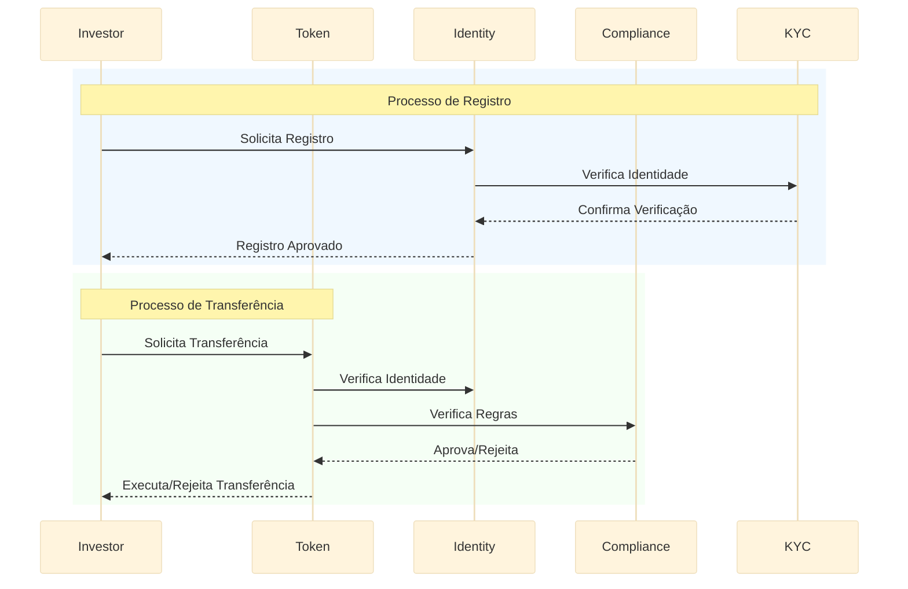
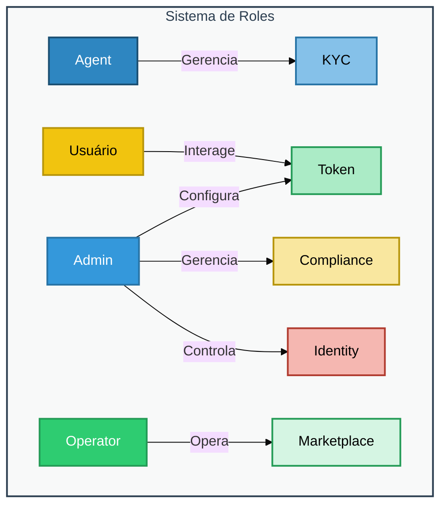

# Arquitetura dos Smart Contracts

Este documento descreve a arquitetura dos smart contracts do projeto RWA Hub, baseado no padrão ERC-3643.

## Visão Geral do Ecossistema

```mermaid
%%{init: {'theme': 'base', 'themeVariables': { 'fontSize': '16px'}}}%%
graph TD
    subgraph Token Core["Token Core (Sistema Principal)"]
        T[Token - ERC-3643] --> IR[Identity Registry]
        T --> CR[Compliance Registry]
        T --> TR[Token Registry]
    end

    subgraph Identity Management["Gestão de Identidade"]
        IR --> IRS[Identity Registry Storage]
        IR --> IRSC[Identity Registry Service]
        IRSC --> KYC[KYC Provider]
        IRSC --> AML[AML Provider]
    end

    subgraph Compliance Layer["Camada de Compliance"]
        CR --> CS[Compliance Storage]
        CR --> CM[Compliance Module]
        CM --> RT[Rules & Thresholds]
        CM --> TL[Transfer Limits]
        CM --> WL[Whitelist]
    end

    subgraph Token Management["Gestão de Token"]
        TR --> TS[Token Storage]
        TR --> TF[Token Factory]
        TF --> MP[Marketplace]
    end

    subgraph Governance["Governança"]
        GOV[Governance] --> T
        GOV --> IR
        GOV --> CR
    end

    %% Estilização dos Componentes Principais
    style T fill:#2E86C1,stroke:#1B4F72,stroke-width:2px,color:#FFFFFF
    style IR fill:#3498DB,stroke:#2874A6,stroke-width:2px,color:#FFFFFF
    style CR fill:#2ECC71,stroke:#239B56,stroke-width:2px,color:#FFFFFF
    style TR fill:#F1C40F,stroke:#B7950B,stroke-width:2px,color:#000000
    style GOV fill:#E74C3C,stroke:#B03A2E,stroke-width:2px,color:#FFFFFF

    %% Estilização dos Subcomponentes
    style IRS fill:#85C1E9,stroke:#2874A6,stroke-width:2px,color:#000000
    style IRSC fill:#85C1E9,stroke:#2874A6,stroke-width:2px,color:#000000
    style KYC fill:#85C1E9,stroke:#2874A6,stroke-width:2px,color:#000000
    style AML fill:#85C1E9,stroke:#2874A6,stroke-width:2px,color:#000000
    
    style CS fill:#ABEBC6,stroke:#239B56,stroke-width:2px,color:#000000
    style CM fill:#ABEBC6,stroke:#239B56,stroke-width:2px,color:#000000
    style RT fill:#ABEBC6,stroke:#239B56,stroke-width:2px,color:#000000
    style TL fill:#ABEBC6,stroke:#239B56,stroke-width:2px,color:#000000
    style WL fill:#ABEBC6,stroke:#239B56,stroke-width:2px,color:#000000
    
    style TS fill:#F9E79F,stroke:#B7950B,stroke-width:2px,color:#000000
    style TF fill:#F9E79F,stroke:#B7950B,stroke-width:2px,color:#000000
    style MP fill:#F9E79F,stroke:#B7950B,stroke-width:2px,color:#000000

    %% Estilização dos Subgraphs
    classDef subgraphStyle fill:#F8F9F9,stroke:#2C3E50,stroke-width:2px,color:#2C3E50
    class Token Core,Identity Management,Compliance Layer,Token Management,Governance subgraphStyle
```

## Componentes do ERC-3643

### Token Principal
- Implementação do ERC-3643
- Gerenciamento de transferências reguladas
- Integração com registros de identidade e compliance

### Identity Registry
- Gerenciamento de identidades verificadas
- Integração com provedores KYC/AML
- Armazenamento de dados de identidade
- Validação de investidores

### Compliance Registry
- Regras de conformidade regulatória
- Limites de transferência
- Restrições de negociação
- Whitelist/Blacklist de endereços

### Token Registry
- Registro de tokens emitidos
- Fábrica de tokens
- Integração com marketplace

## Fluxo de Operações



## Estrutura de Permissões e Roles



## Notas de Implementação

- Implementação completa do padrão ERC-3643
- Sistema modular e atualizável
- Mecanismos de recuperação e pausa
- Eventos para auditoria e rastreamento
- Integração com provedores externos de KYC/AML
- Sistema de permissões granular

## Características de Segurança

- Controles de acesso baseados em roles
- Verificações de identidade multi-nível
- Validações de compliance em tempo real
- Mecanismos de pausa de emergência
- Auditoria completa de transações

## Próximos Passos

1. Implementação dos módulos de compliance específicos
2. Integração com provedores KYC/AML
3. Desenvolvimento da interface do marketplace
4. Testes de integração completos
5. Auditoria de segurança
6. Documentação técnica detalhada
7. Implementação de features adicionais de governança 